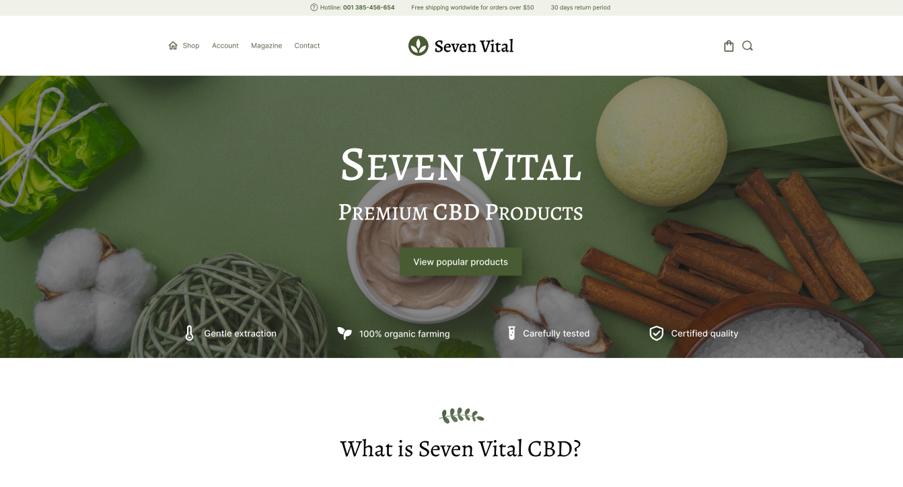

# Seven Vital webPage

## Table of contents

- [Overview](#overview)
  - [Preview](https://seven-vital.vercel.app/)
- [My process](#my-process)
  - [Built with](#built-with)
- [Status](#project-status)
- [Author](#author)
- [Author Desicn](#author-design)

## Overview

## My process

###### Built with

- [HTML](https://developer.mozilla.org/en-US/docs/Web/HTML)
- [CSS](https://developer.mozilla.org/en-US/docs/Web/CSS)
- Node modules
  - [sass](https://sass-lang.com/)
- [REACT](https://reactjs.org/) - framework
- [NEXT.js](https://nextjs.org/) - react framework

###### Project status

###### Author

